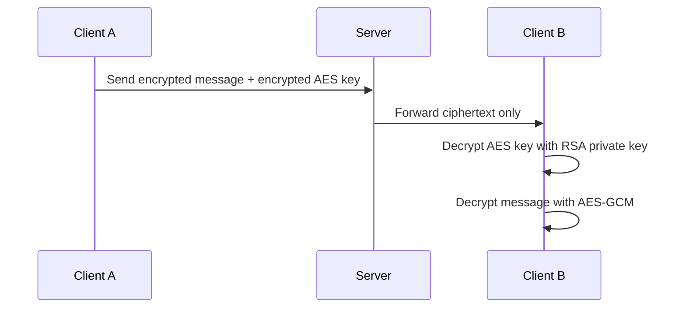

## Architecture Diagram

## Encryption Flow Explanation

### Sending a Message
- User writes a message on Client A  
- A random AES-GCM key is generated  
- Message is encrypted using AES-GCM → ciphertext + iv  
- AES key is encrypted using receiver’s RSA public key  
- Payload sent to server includes:
  - encrypted message  
  - encrypted AES key  
  - iv  
  - sender public key  

---

### Receiving a Message
- Client B receives encrypted payload  
- RSA private key is used to decrypt AES key  
- AES key decrypts the message  
- Plaintext is displayed in UI  

---

## Key Management Explanation

Each user has:
- RSA Public Key → stored on server  
- RSA Private Key → stored ONLY on client  

Private key never leaves the device after login.

---

## Security Trade-offs

### Strengths
- End-to-End Encryption (server cannot read messages)  
- AES-GCM ensures confidentiality + integrity  
- RSA ensures secure key exchange  
- Private keys never leave client device  

### Limitations / Trade-offs
- If device is compromised → private key is exposed  
- No forward secrecy (unless ECDH is added)  
- Key recovery depends on password strength  
- Metadata (sender/receiver/time) is still visible  
